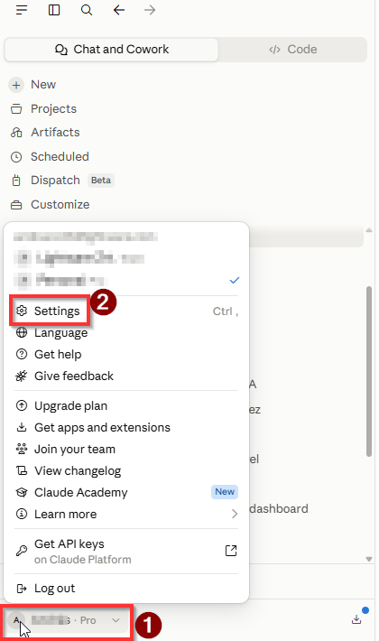
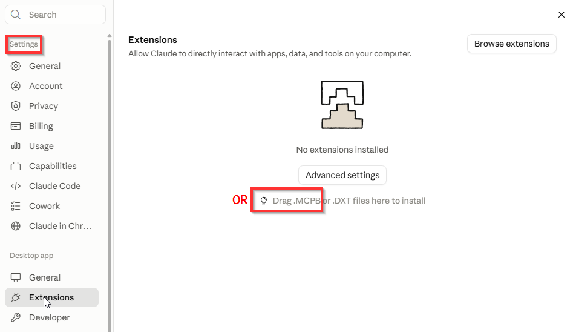
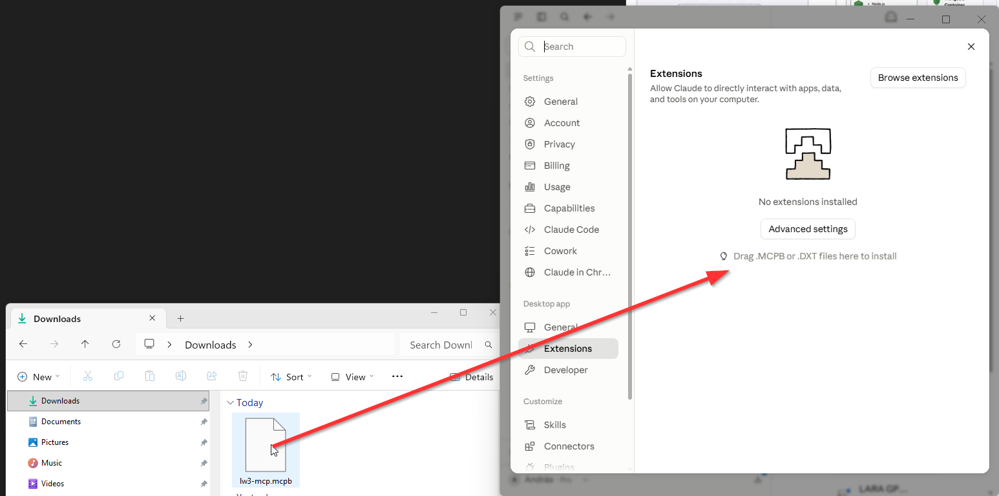
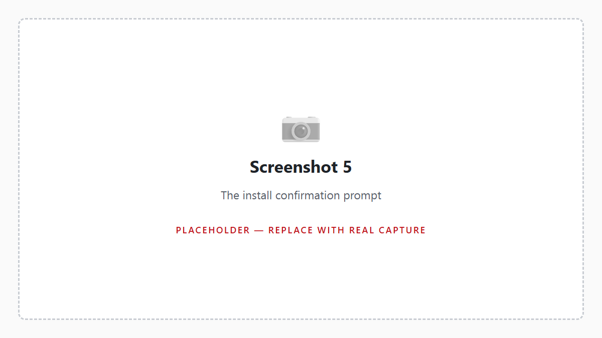
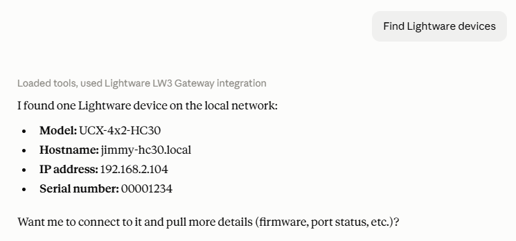
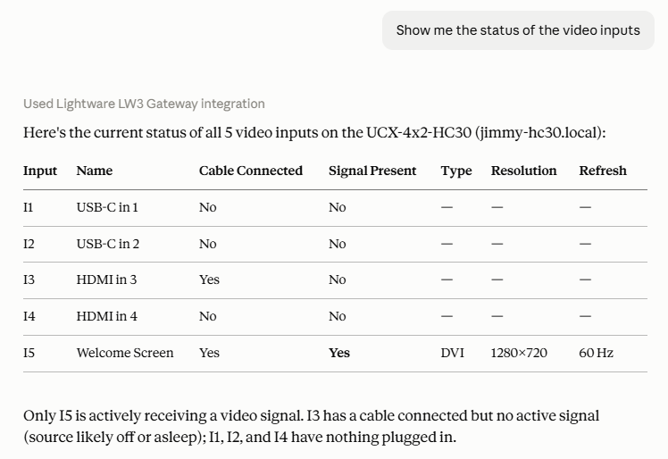

# Installing the Lightware LW3 Gateway — picture guide

## Before you start

You need **Claude Desktop** installed, and you need to be **on the same network
as the Lightware device** — the office network or a wired connection, not a
guest network. If you are connected to a VPN, disconnect it first. The gateway
finds devices by broadcasting on the local network, and a VPN sends that
broadcast to the wrong place.

---

## Step 1 — Download the file

Click here:

**https://github.com/tothandrastata/lw3-mcp/releases/latest/download/lw3-mcp.mcpb**

Your browser saves `lw3-mcp.mcpb` to your Downloads folder.

> **If your browser warns you about the file**, that is expected. It is an
> unfamiliar file type, not a dangerous one. Choose *Keep* or *Download anyway*.

---

## Step 2 — Open Claude Desktop's settings

Open Claude Desktop. Click the **gear icon** to open Settings.

In the list on the left, scroll past the first group to the **Desktop app**
heading and click **Extensions** underneath it.

## Step 3 — Drag the file in

The Extensions page has a line near the middle reading
**"Drag .MCPB or .DXT files here to install"**. That is the target.

Open your Downloads folder next to the Claude Desktop window, then drag
`lw3-mcp.mcpb` out of Downloads and drop it on that line.

> **If nothing happens when you drop it**, click **Advanced settings** —
> the button just above that line — and look there for the option to install
> an extension from a file, then pick `lw3-mcp.mcpb` from your Downloads
> folder instead.

## Step 4 — Configure permissions

You can avoid allowance of each tool (GET / SET / CALL / ...) separately by allowing all:

## Step 5 — Try it

Start a new chat and type:

> Discover Lightware devices on the network

Claude replies with the devices it found — model name, serial number, and IP
address for each one.

Then connect to one and ask for whatever you need:

> **If Claude asks for a password**, that is expected — some devices only
> accept a secure connection that needs the device's **admin** password (the
> same one you'd use to log in to the device's own web page). It goes straight
> to the device; this extension does not store it or show it back to you.

## If something goes wrong

**No devices found.** You are probably on a VPN or a guest network. Disconnect
the VPN and try again. If you know the device's IP address, you can skip
discovery entirely — just say *"Connect to 192.168.2.109"* with the real
address.

**"Not connected to a device".** Ask Claude to connect first. The connection
closes when you quit Claude Desktop, so you reconnect each time you restart it.

**It seems stuck when connecting.** The extension tries a couple of ways to
reach the device automatically, so this is rarer than it used to be, but it
can still happen if the address is wrong or a firewall blocks both. Double-check
the IP address and that you are on the office network.

**Anything else** — send a screenshot to Andras Toth.

---

## Getting a newer version

Extensions do not update themselves. When a new version is announced, use the
same download link from Step 1 and drag the new file in the same way. It
replaces what you have.

To see which version you are running, open Settings → Extensions and look at the
number next to Lightware LW3 Gateway.
